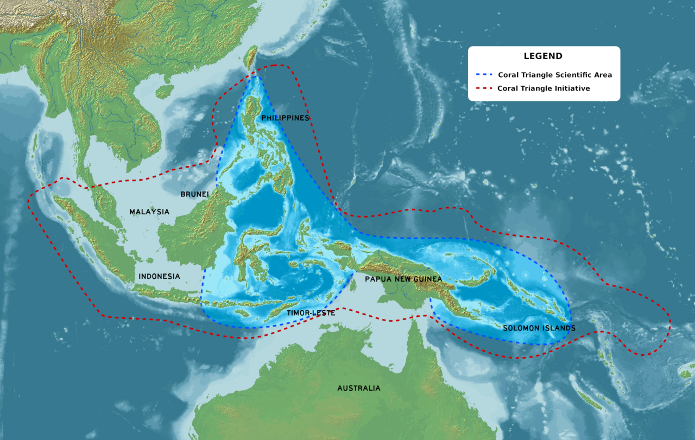

Kawasan pantai dan pesisir Indonesia ditopang oleh hutan bakau, padang lamun, dan terumbu karang yang saling bergantung satu sama lain.

Indonesia adalah episentrum Segitiga Terumbu Karang (_The Coral Triangle_) yang merupakan rumah bagi 76% spesies koral dan 37% spesies ikan karang dunia. Terdapat  2.500 jenis ikan, 2.500 jenis kerang, dan 1.500 jenis udang tersebar di kawasan. Ikan-ikan besar seperti tuna, manta, hiu, dan hiu paus memangsa hewan laut yang hidup di terumbu karang. Terumbu karang menyediakan bahan makanan melimpah serta tempat berlindung bagi banyak hewan laut.

Dewasa ini, perubahan iklim mengancam kelestarian terumbu karang. Namun, kerusakan yang disebabkan manusia mungkin lebih mengkhawatirkan: bom laut, jala pukat harimau, penambangan pasir, dan penangkapan ikan secara berlebihan. Selain itu, kerusakan terumbu karang juga bisa dipicu oleh rusaknya hutan bakau.

Indonesia memiliki hutan bakau terluas di dunia—mencakup 20% luas hutan bakau dunia.

Hutan bakau adalah ekosistem yang produktif. 75% ikan komersial menetas, tumbuh, dan berkembang di situ. 

Hutan bakau melindungi dua sisi kawasan pesisir. Di darat, mencegah abrasi. Di laut, mencegah pelumpuran dan pencemaran air.

Hutan bakau erat kaitannya dengan peradaban manusia. Di berbagai belahan dunia, terdapat beragam tradisi yang mengultuskan hutan bakau. 

Dulu, pesisir Pulau Jawa pada abad ke-19 masih dipenuhi hutan bakau. Kini, hutan bakau di pulau Jawa sudah hampir punah. Sumatra dan Kalimantan juga mengalami nasib yang sama. Beruntung Indonesia masih punya hutan bakau cukup luas di Papua—hampir separuh luas hutan bakau di Indonesia. Namun, hutan bakau di sana juga terancam punah.

Reboisasi hutan bakau seharusnya lebih diprioritaskan sebab ia mampu menyerap 50 kali lebih banyak karbon daripada hutan di daratan.

Di antara hutan bakau dan terumbu karang, Indonesia punya padang lamun terluas dan tertinggi di dunia. Ekosistem hutan bakau, padang lamun, dan terumbu karang sangat penting dalam membentuk jati diri Indonesia sebagai negara kepulauan dan bahari.
