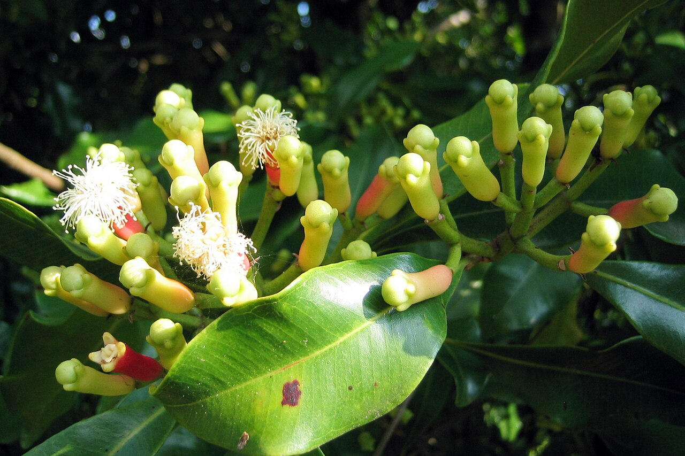

Barus tercatat dalam _Geographike Hyphegesis_ karya Claudius Ptolemy sebagai kota pelabuhan penting di jalur perdagangan rempah dunia. Tidak hanya memasok kapur barus, Barus juga menjajakan berbagai rempah yang didatangkan dari penjuru Nusantara. Rempah-rempah adalah komoditas mahal yang diperjualbelikan sejak dulu kala—jauh sebelum kolonial Eropa mengincarnya. Jalur perdagangan rempah menghubungkan kota pelabuhan seperti Barus, Ternate, dan Demak.

Pelabuhan Demak sudah dikenal sejak zaman Majapahit. Marco Polo (1254-1324) pernah singgah di sana dan menyebut Jawa sebagai produsen lada, pala, lengkuas, cengkih, dan tanaman obat lainnya. Ibnu Batutah (1304-1369) belum pernah ke Jawa, hanya sempat singgah di Lhokseumawe dalam perjalanannya ke Tiongkok, namun catatan perjalanannya menggambarkan kemakmuran Jawa yang hijau dan berbunga di mana penduduknya lalu lalang membawa koin emas. Banyak pedagang Muslim yang sezaman dengannya berkunjung ke Demak. Tidak mengherankan bila Demak jadi pusat penyebaran Islam di Jawa. Selain pedagang Arab, orang-orang Persia, Tiongkok, India, dan Eropa juga ramai-ramai berkunjung ke Demak. Keragaman etnis ini menjadikan Demak kota pelabuhan kosmopolitan yang multikultural dan multireligius.

Barus dan Demak adalah saksi kejayaan ekonomi maritim Indonesia. Pemerintah bahkan meminta _UNESCO_ untuk mengakui jalur perdagangan rempah sebagai warisan dunia.

Meski daya tarik rempah tidak semasif dulu, rempah masih menjadi komoditas penting. Kebutuhan akan rempah tidak pernah sirna. Selain dipakai untuk bumbu masakan, rempah adalah bahan dasar obat, kosmetik, dan minyak astiri.

Minyak astiri atau minyak esensial punya nilai ekonomi yang bagus di pasaran. Menurut Dewan Astiri Indonesia, terdapat 400-500 jenis tanaman rempah yang bisa tumbuh di negeri ini. Indonesia adalah pemasok minyak astiri terbesar di dunia—mengusai 70% pangsa pasar dunia.

Minyak astiri yang populer adalah minyak cengkih dan pala, namun Indonesia belum mampu memenuhi permintaan pasar. Kerusakan lingkungan dan kemunduran sektor pertanian membuat produksi rempah menyusut. Jika produksi rempah menyusut, potensi ekonomi akan hilang dan kemiskinan semakin meradang.

Menurut data Badan Pusat Statistik (BPS) tahun 2022, tingkat kemiskinan di wilayah pesisir seperti Barus dan Demak mencapai 13%, melebihi rata-rata nasional.

Rempah hanya salah satu tulang punggung ekonomi maritim Indonesia. Sektor perikanan tangkap, budi daya laut, wisata bahari, serta transportasi laut masih belum dimanfaatkan secara optimal. Potensi ekonomi maritim Indonesia diperkirakan mencapai Rp4.875 triliun.

Dengan ribuan pulau yang tersebar dari Sabang sampai Merauke, seharusnya perdagangan antar pulau sudah bisa menghidupi banyak orang—apa lagi ditambah dengan ekspor. Buruknya transportasi laut di Indonesia jadi penghambat kemajuan ekonomi maritim.

Untuk menopang ekonomi maritim, riset-riset tentang transportasi bahari perlu diperluas. Industri kapal dan pesawat Indonesia tidak boleh mati.

Pada masa Perang Dingin, Rusia membuat prototipe kendaraan baru hasil perkawinan antara kapal perang dan pesawat tempur yang disebut _GEV_ (_Ground Effect Vehicles_). Mereka menamainya _Ekranoplan_. Wahana ini hanya melayang beberapa meter dari permukaan laut, namun melaju lebih cepat dari kapal mana pun. Perkembangan teknologi ini diilhami oleh burung-burung yang terbang rendah memanfaatkan efek bantalan udara di permukaan laut yang membuat mereka melaju cepat tanpa memerlukan tenaga besar. Efek bantalan udara itulah yang membuat _GEV_ mampu menghemat bahan bakar.

Perkembangan wahana ini dihentikan setelah Perang Dingin berakhir. Kini, Amerika Serikat mengambil tongkat estafet dari Rusia. Pada 2023, _DARPA_ meminta anak perusahaan _Boeing_ untuk merakit _GEV_ seukuran _Ekranoplan_.

Indonesia tidak perlu wahana-wahana raksasa seperti itu. Kita bisa belajar dari Singapura dan Cina yang telah mengembangkan _mini-ekranoplan_ untuk memperlancar hubungan antar pulau dan memperkuat ekonomi maritim.
